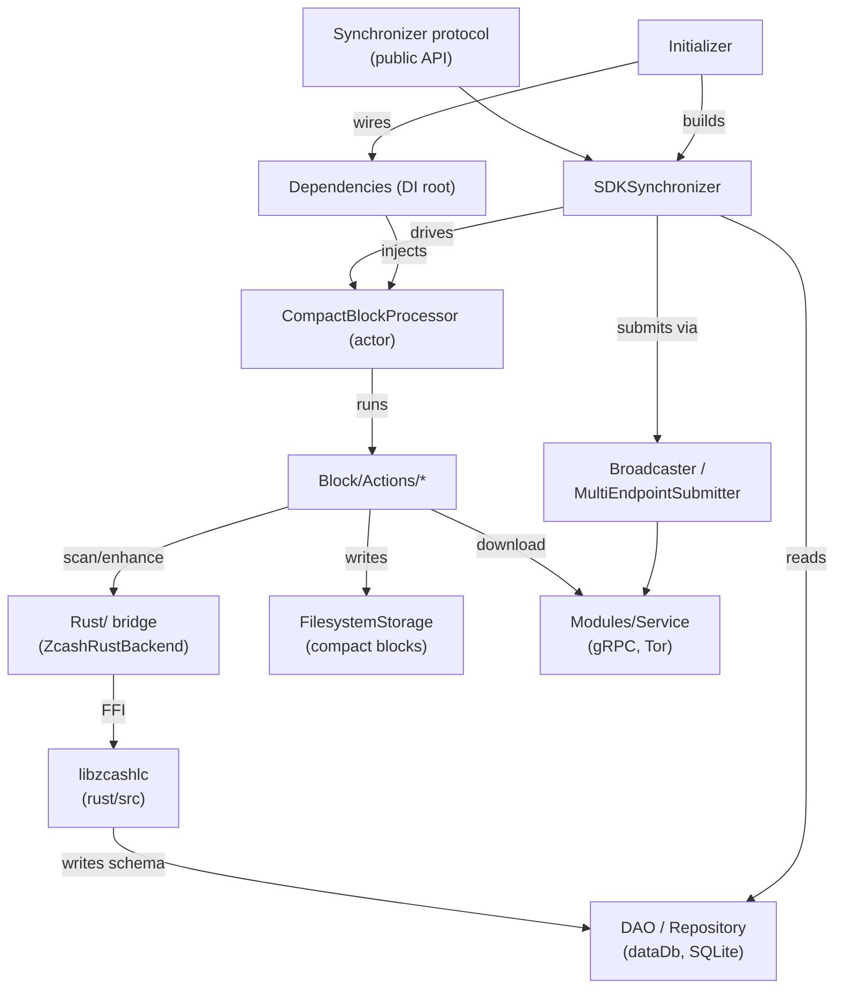

# The Module Map

## 1. Why this chapter exists

`ZcashLightClientKit` is two codebases that share one repository: a Swift
package under `Sources/ZcashLightClientKit/` and a Rust crate (`libzcashlc`)
under `rust/src/`. A contributor who edits the wrong layer, or who reaches
across the boundary between them in the wrong place, produces code that either
will not link or that silently corrupts wallet state. This chapter is the map
you return to most: it names the two layers, the single bridge between them,
and every top-level directory and file, with a pointer to the test target or
later chapter that exercises it. By the end you should be able to answer "which
directory owns X" without grepping. The file you will touch by the end of this
chapter is `Package.swift` (the target list), and you will run
`swift test --filter OfflineTests`.

## 2. Definitions

**Definition 2.1 (Swift SDK layer).** The orchestration layer, all of
`Sources/ZcashLightClientKit/`. It owns networking, on-disk block storage,
public API, dependency injection, and the sync state machine. It reads wallet
metadata from a SQLite `dataDb` but does not write the wallet schema itself.

**Definition 2.2 (Rust core layer).** The crate `libzcashlc`, rooted at
`rust/src/lib.rs`. It performs key derivation, note scanning, transaction
construction, and owns the wallet DB schema and migrations. It is compiled to a
static library and packaged as an XCFramework. The crate's `[lib]` section
fixes its name and entry point:

```toml reference title="Cargo.toml"
https://github.com/zcash/zcash-swift-wallet-sdk/blob/fe836893bc71fc3e6eb173f4fc191aa43c3760af/Cargo.toml#L102-L105
```

**Definition 2.3 (the bridge).** The directory
`Sources/ZcashLightClientKit/Rust/`. Two protocols partition it:
`ZcashRustBackendWelding` (the DB-bound surface) and
`ZcashKeyDerivationBackendWelding` (the stateless key-derivation surface). The
concrete `ZcashRustBackend` and `ZcashKeyDerivationBackend` are the ONLY callers
of the generated `libzcashlc` C header.

```swift reference title="Sources/ZcashLightClientKit/Rust/ZcashRustBackendWelding.swift"
https://github.com/zcash/zcash-swift-wallet-sdk/blob/fe836893bc71fc3e6eb173f4fc191aa43c3760af/Sources/ZcashLightClientKit/Rust/ZcashRustBackendWelding.swift#L37-L37
```

**Invariant 2.4 (one boundary).** Every call into `zcashlc_*` C symbols goes
through `Sources/ZcashLightClientKit/Rust/`. No other Swift file imports
`libzcashlc`. The bridge is covered in detail in
[the Swift/Rust bridge](./04-swift-rust-bridge.md).

**Rule 2.5 (error sentinels).** All Rust FFI functions are named `zcashlc_*`,
declared `#[unsafe(no_mangle)] extern "C"`, wrap their body in
`catch_panic(...)`, and return a sentinel (false / -1 / null) on error. The
error text crosses the boundary through a thread-local read by
`zcashlc_last_error_length` plus `zcashlc_error_message_utf8`:

```rust reference title="rust/src/lib.rs"
https://github.com/zcash/zcash-swift-wallet-sdk/blob/fe836893bc71fc3e6eb173f4fc191aa43c3760af/rust/src/lib.rs#L240-L262
```

The full FFI contract is the subject of
[the Rust core and FFI surface](./03-rust-core-ffi-surface.md).

### Dependency graph

The arrows below read "depends on / calls into". The public API sits at the top;
the Rust core and the persistence and networking layers sit at the bottom.



## 3. The code

### The package and crate declarations

The Swift package declares one library product and the target list that the rest
of this section walks. The targets array also shows the five test targets, which
the tables below reference.

```swift reference title="Package.swift"
https://github.com/zcash/zcash-swift-wallet-sdk/blob/fe836893bc71fc3e6eb173f4fc191aa43c3760af/Package.swift#L40-L99
```

Two things to note in that array. First, the `ZcashLightClientKit` target
excludes the `.proto` source files and the Sourcery directory from compilation
(lines 44-49); generated `*.pb.swift` files are checked in instead. Second, the
five test targets (lines 76-98) are the rows of the test-dependency table in
[the build and contribution loop](./02-build-test-contribution-loop.md).

### Top-level Swift directories

Every directory directly under `Sources/ZcashLightClientKit/`. The "exercised
by" column names the `OfflineTests` file or the later chapter that covers it.

| Directory      | Purpose (one line)                                                     | Most important type           | Exercised by                                                                                                                   |
| -------------- | ---------------------------------------------------------------------- | ----------------------------- | ------------------------------------------------------------------------------------------------------------------------------ |
| `Account`      | Account models and account-balance accessors.                          | `AccountUUID`                 | [persistence](./10-persistence.md)                                                                                             |
| `Block`        | The sync engine: processor, actions, download, scan, enhance, storage. | `CompactBlockProcessor`       | `Tests/OfflineTests/CompactBlockProcessorActions`; [the processor](./07-compact-block-processor-and-actions.md)                |
| `Checkpoint`   | Bundled chain checkpoints that seed wallet birthdays.                  | `BundleCheckpointSource`      | `Tests/OfflineTests/CheckpointSourceTests.swift`; [checkpoints](./16-checkpoints.md)                                           |
| `Constants`    | Network and SDK-wide constant values.                                  | `ZcashSDK`                    | grep usage across the SDK                                                                                                      |
| `DAO`          | Data-access objects over the SQLite `dataDb`.                          | `TransactionRepository` impls | `Tests/OfflineTests/TransactionRepositoryTests.swift`; [persistence](./10-persistence.md)                                      |
| `Entity`       | Row/record types stored in or read from the wallet DB.                 | `ZcashTransaction`            | `Tests/OfflineTests/ZcashTransactionStateTests.swift`                                                                          |
| `Error`        | The generated `ZcashError` model and its codes.                        | `ZcashError`                  | `Tests/OfflineTests/ZcashErrorLocalizedTests.swift`; [error model](./17-error-model.md)                                        |
| `Extensions`   | Foundation/standard-library extensions used SDK-wide.                  | (free functions)              | indirectly via most tests                                                                                                      |
| `Metrics`      | Sync timing and performance metrics.                                   | `SDKMetrics`                  | [the processor](./07-compact-block-processor-and-actions.md)                                                                   |
| `Model`        | Value types of the public API surface (memos, amounts, addresses).     | `Zatoshi`, `Memo`             | `Tests/OfflineTests/ZatoshiTests.swift`, `MemoTests.swift`                                                                     |
| `Modules`      | Service abstraction layer (currently `Service/`: gRPC + Tor).          | `LightWalletService`          | [networking](./11-networking-grpc.md), [Tor](./12-tor.md)                                                                      |
| `Providers`    | Injected providers (time, current-block, etc.).                        | `LatestBlocksDataProvider`    | injected in tests via mocks                                                                                                    |
| `Repository`   | Read-side repositories layered over `DAO`.                             | `BlockRepository`             | `Tests/OfflineTests/PagedTransactionRepositoryTests.swift`                                                                     |
| `Resources`    | Bundled checkpoints and other copied resources.                        | (checkpoint JSON)             | `Tests/OfflineTests/CheckpointSourceTests.swift`                                                                               |
| `Rust`         | The bridge: the only callers of `libzcashlc`.                          | `ZcashRustBackend`            | `Tests/OfflineTests/ZcashRustBackendTests.swift`; [the bridge](./04-swift-rust-bridge.md)                                      |
| `Synchronizer` | The concrete `SDKSynchronizer` and the DI composition root.            | `SDKSynchronizer`             | `Tests/OfflineTests/SynchronizerOfflineTests.swift`; [synchronizer](./06-synchronizer-and-public-api.md)                       |
| `Tool`         | Public derivation tool wrapping the key-derivation backend.            | `DerivationTool`              | `Tests/OfflineTests/DerivationToolTests`; [the bridge](./04-swift-rust-bridge.md)                                              |
| `Tor`          | Swift-side Tor client.                                                 | `TorClient`                   | [Tor](./12-tor.md)                                                                                                             |
| `Transaction`  | Encoding and multi-endpoint submission of transactions.                | `MultiEndpointSubmitter`      | `Tests/OfflineTests/MultiEndpointSubmitterTests.swift`; [multi-server submission](./14-broadcaster-multi-server-submission.md) |
| `Utils`        | Logging, hashing, path helpers, and small utilities.                   | `Logger`                      | indirectly via most tests                                                                                                      |

### Top-level Swift files

| File                        | Purpose (one line)                                                               | Most important type   | Exercised by                                                                                                        |
| --------------------------- | -------------------------------------------------------------------------------- | --------------------- | ------------------------------------------------------------------------------------------------------------------- |
| `Initializer.swift`         | User-facing setup: validates paths, configures logging, builds the synchronizer. | `Initializer`         | `Tests/OfflineTests/InitializerOfflineTests.swift`; [synchronizer](./06-synchronizer-and-public-api.md)             |
| `Synchronizer.swift`        | The public protocol every client codes against.                                  | `Synchronizer`        | `Tests/OfflineTests/SynchronizerOfflineTests.swift`; [synchronizer](./06-synchronizer-and-public-api.md)            |
| `Broadcaster.swift`         | Protocol for creating, finalizing, and submitting transactions.                  | `Broadcaster`         | `Tests/OfflineTests/BroadcasterTests.swift`; [multi-server submission](./14-broadcaster-multi-server-submission.md) |
| `ClosureSynchronizer.swift` | Closure-based adapter over the async `Synchronizer`.                             | `ClosureSynchronizer` | `Tests/OfflineTests/ClosureSynchronizerOfflineTests.swift`                                                          |
| `CombineSynchronizer.swift` | Combine-publisher adapter over the async `Synchronizer`.                         | `CombineSynchronizer` | `Tests/OfflineTests/CombineSynchronizerOfflineTests.swift`                                                          |

The public protocol and its two adapters share one surface; the adapters delegate
to the async API rather than reimplementing it:

```swift reference title="Sources/ZcashLightClientKit/Synchronizer.swift"
https://github.com/zcash/zcash-swift-wallet-sdk/blob/fe836893bc71fc3e6eb173f4fc191aa43c3760af/Sources/ZcashLightClientKit/Synchronizer.swift#L94-L97
```

```swift reference title="Sources/ZcashLightClientKit/ClosureSynchronizer.swift"
https://github.com/zcash/zcash-swift-wallet-sdk/blob/fe836893bc71fc3e6eb173f4fc191aa43c3760af/Sources/ZcashLightClientKit/ClosureSynchronizer.swift#L16-L23
```

The concrete implementation is a `public class` (its internal sync work is driven
by the `CompactBlockProcessor` actor, see below):

```swift reference title="Sources/ZcashLightClientKit/Synchronizer/SDKSynchronizer.swift"
https://github.com/zcash/zcash-swift-wallet-sdk/blob/fe836893bc71fc3e6eb173f4fc191aa43c3760af/Sources/ZcashLightClientKit/Synchronizer/SDKSynchronizer.swift#L14-L14
```

`Initializer` validates configuration and hands it to the synchronizer:

```swift reference title="Sources/ZcashLightClientKit/Initializer.swift"
https://github.com/zcash/zcash-swift-wallet-sdk/blob/fe836893bc71fc3e6eb173f4fc191aa43c3760af/Sources/ZcashLightClientKit/Initializer.swift#L95-L95
```

`Broadcaster` is the submission-side protocol; its `createProposedTransactions`,
`createTransactionFromPCZT`, and submit methods are walked in
[transactions](./13-transactions-proposal-to-broadcast.md) and
[multi-server submission](./14-broadcaster-multi-server-submission.md):

```swift reference title="Sources/ZcashLightClientKit/Broadcaster.swift"
https://github.com/zcash/zcash-swift-wallet-sdk/blob/fe836893bc71fc3e6eb173f4fc191aa43c3760af/Sources/ZcashLightClientKit/Broadcaster.swift#L31-L40
```

### The sync engine, inside `Block`

`CompactBlockProcessor` is a Swift actor that drives a `CBPState` state machine
over an ordered list of `Action`s. Each action mutates a shared `ActionContext`.
The strategy is "spend before sync": blocks may be scanned out of order via
suggested scan ranges so spendable notes appear early.

```swift reference title="Sources/ZcashLightClientKit/Block/CompactBlockProcessor.swift"
https://github.com/zcash/zcash-swift-wallet-sdk/blob/fe836893bc71fc3e6eb173f4fc191aa43c3760af/Sources/ZcashLightClientKit/Block/CompactBlockProcessor.swift#L16-L16
```

The action files under `Block/Actions/` (download, validate server, update chain
tip, update subtree roots, process suggested scan ranges, scan, enhance, fetch
UTXOs, clear cache, resubmit, migrate legacy cache DB, rewind) are walked in
[the processor and actions](./07-compact-block-processor-and-actions.md). The
`Action` protocol itself is one file:

```swift reference title="Sources/ZcashLightClientKit/Block/Actions/Action.swift"
https://github.com/zcash/zcash-swift-wallet-sdk/blob/fe836893bc71fc3e6eb173f4fc191aa43c3760af/Sources/ZcashLightClientKit/Block/Actions/Action.swift#L1-L20
```

### Rust core modules

Every module under `rust/src/`. The crate root re-exports and the `voting`
module is itself split into submodules.

| Module / file     | Purpose (one line)                                                           | Exercised by                                                                                   |
| ----------------- | ---------------------------------------------------------------------------- | ---------------------------------------------------------------------------------------------- |
| `lib.rs`          | Crate root: most `zcashlc_*` DB-bound FFI functions, panic/error plumbing.   | `Tests/OfflineTests/ZcashRustBackendTests.swift`; [FFI surface](./03-rust-core-ffi-surface.md) |
| `ffi.rs`          | Shared FFI `#[repr(C)]` types (e.g. `Account`) and helpers used by `lib.rs`. | [FFI surface](./03-rust-core-ffi-surface.md)                                                   |
| `ffi/` (`sys.rs`) | Low-level system bindings (os_log C symbols) used by the FFI.                | [FFI build pipeline](./05-ffi-build-pipeline.md)                                               |
| `derivation.rs`   | Key derivation FFI; backs `ZcashKeyDerivationBackend`.                       | `Tests/OfflineTests/DerivationToolTests`; [the bridge](./04-swift-rust-bridge.md)              |
| `eip681.rs`       | EIP-681 payment-request parsing FFI.                                         | `Tests/OfflineTests/Eip681Tests.swift`                                                         |
| `tor.rs`          | Tor runtime and channel construction FFI.                                    | [Tor](./12-tor.md)                                                                             |
| `voting.rs`       | Voting FFI entry module; declares the voting submodules.                     | `Tests/OfflineTests/VotingRustBackendTests.swift`; [voting](./15-voting.md)                    |
| `voting/`         | Voting implementation: db, rounds, notes, tree, recovery, PIR, etc.          | `Tests/OfflineTests/VotingRustBackendTests.swift`; [voting](./15-voting.md)                    |
| `os_log.rs`       | Bridges Rust `tracing` to Apple `os_log` / signposts.                        | [FFI build pipeline](./05-ffi-build-pipeline.md)                                               |
| `os_log/`         | `layer.rs`, `signpost.rs`, `writer.rs`: the os_log tracing layer internals.  | [FFI build pipeline](./05-ffi-build-pipeline.md)                                               |

The `voting.rs` entry module simply enumerates its submodules, which is why the
table lists `voting/` separately:

```rust reference title="rust/src/voting.rs"
https://github.com/zcash/zcash-swift-wallet-sdk/blob/fe836893bc71fc3e6eb173f4fc191aa43c3760af/rust/src/voting.rs#L1-L21
```

### Hot files

The files contributors edit most, with one sentence each on what changes there.

- `rust/src/lib.rs`: add or modify a DB-bound `zcashlc_*` FFI function (scanning,
  proposals, migrations).
- `rust/src/ffi.rs`: add or change an FFI `#[repr(C)]` type crossing the
  boundary, such as the account-metadata struct.
- `Sources/ZcashLightClientKit/Rust/Voting/VotingRustBackend.swift`: extend the
  Swift side of the voting FFI surface.
- `Sources/ZcashLightClientKit/Synchronizer/SDKSynchronizer.swift`: change public
  synchronizer behavior, state transitions, or event emission.
- `rust/src/voting/*`: change voting rounds, note tracking, tree sync, or PIR
  client logic.
- `rust/src/tor.rs`: change how the Tor runtime or lightwalletd-over-Tor channel
  is built.
- `rust/src/derivation.rs`: change how unified keys and addresses are derived.
- `Broadcaster.swift`: change the create/finalize/submit transaction protocol
  surface.
- `Error/ZcashErrorCodeDefinition.swift`: add a new error variant (then rerun
  Sourcery; never hand-edit the generated `ZcashError.swift`).

## 4. Failure modes

- Hand-editing a generated file (`Error/ZcashError.swift`,
  `Error/ZcashErrorCode.swift`, `*.pb.swift`, or
  `Tests/TestUtils/Sourcery/GeneratedMocks/AutoMockable.generated.swift`): the
  next Sourcery or protobuf regeneration overwrites your change, so the edit is
  lost. No automated test in this workspace; caught by audit only (review of the
  Sourcery source `Error/ZcashErrorCodeDefinition.swift`).
- Importing `libzcashlc` from a Swift file outside `Sources/ZcashLightClientKit/Rust/`:
  breaks Invariant 2.4 and scatters unsafe pointer handling across the codebase.
  No automated test in this workspace; caught by audit only.
- Returning a non-sentinel value or omitting `catch_panic` in a new `zcashlc_*`
  function: a Rust panic unwinds across the FFI boundary, which is undefined
  behavior. Caught by: `Tests/OfflineTests/ZcashRustBackendTests.swift` exercises
  the bridge round-trips, but the panic-safety wrapper itself has no dedicated
  test; confirm by reading `rust/src/lib.rs` lines 240-262 and the `catch_panic`
  usage. Caught by audit only for the wrapper.
- Adding parallelism inside the `CompactBlockProcessor` action pipeline (running
  actions concurrently): the actions assume serial mutation of a single
  `ActionContext`. Caught by: `Tests/OfflineTests/CompactBlockProcessorActions`
  (per-action tests assume the serial context).
- Editing `Package.swift`'s exclude list so a `.proto` file is compiled: SwiftPM
  attempts to compile protobuf source as Swift and fails. No automated test in
  this workspace; caught by audit only (and by the build step in
  `.github/workflows/swift.yml`).

## 5. Spec pointers

- `docs/Architecture.md`
  (https://github.com/zcash/zcash-swift-wallet-sdk/blob/fe836893bc71fc3e6eb173f4fc191aa43c3760af/docs/Architecture.md):
  the repo's own architecture note. It is currently a stub that defers to the
  Android SDK structure, which is why this chapter exists as the practical map.
- `MIGRATING.md`
  (https://github.com/zcash/zcash-swift-wallet-sdk/blob/fe836893bc71fc3e6eb173f4fc191aa43c3760af/MIGRATING.md):
  explains the move from a SQLite `cacheDb` to on-disk `FilesystemStorage` for
  compact blocks, which is why `Block/FilesystemStorage/` exists and the old
  cache DB is reached only by `MigrateLegacyCacheDBAction`.
- Zcash Protocol Specification (https://zips.z.cash/protocol/protocol.pdf):
  defines notes, nullifiers, anchors, and the Sapling and Orchard pools that the
  Rust core scans and spends. Relevant when reading anything under `rust/src/`.
- lightwalletd (https://github.com/zcash/lightwalletd): the server the
  `Modules/Service` layer talks to; its proto service defines the compact-block
  and submission RPCs this SDK consumes.

## 6. Exercises

1. (Find which directory owns X.) A client wants to know where the type that
   represents an on-chain transaction record is defined, versus where the
   public-API value types like amounts live. Name the two directories and give
   the file/line range for the `Synchronizer` public protocol declaration and
   the `Broadcaster` public protocol declaration.

2. (Run a command.) Run `swift test --filter OfflineTests` (after the local FFI
   is set up, see [the build loop](./02-build-test-contribution-loop.md)) and
   report how many tests pass. Then grep the test directory: how many `*.swift`
   files are directly under `Tests/OfflineTests/`? Use
   `ls Tests/OfflineTests/*.swift | wc -l`.

3. (Trace a dependency.) Starting from the `Synchronizer` public protocol, follow
   the dependency graph in Section 2 to the single Rust call site. Name every box
   you pass through and cite the file that defines each box's primary type.

4. (Modify code.) In `rust/src/voting.rs`, the entry module lists the voting
   submodules. Without changing behavior, confirm the list matches the files in
   `rust/src/voting/` by running `ls rust/src/voting/` and comparing. If a
   submodule file existed but was not declared in `voting.rs`, what would happen
   at build time? State the answer and verify by reading the module declarations.

### Answers in the code

1. The transaction record type lives in `Entity` (see
   `Sources/ZcashLightClientKit/Entity/`); public value types live in `Model`
   (see `Sources/ZcashLightClientKit/Model/`). The `Synchronizer` protocol is at
   `Sources/ZcashLightClientKit/Synchronizer.swift#L94`; the `Broadcaster`
   protocol is at `Sources/ZcashLightClientKit/Broadcaster.swift#L31`.
2. The count is whatever the local run reports; the file count is checkable with
   the `ls ... | wc -l` command above against `Tests/OfflineTests/`.
3. The path is `Synchronizer.swift#L94` -> `SDKSynchronizer.swift#L14` ->
   `Block/CompactBlockProcessor.swift#L16` -> `Block/Actions/*` ->
   `Rust/ZcashRustBackend.swift#L69` -> `rust/src/lib.rs`.
4. A module file not declared with `mod`/`pub mod` is not compiled into the
   crate at all; Cargo simply ignores it. The declarations are at
   `rust/src/voting.rs#L6-L21`.

## 7. Further reading

- [The build, test, and contribution loop](./02-build-test-contribution-loop.md)
  for how the two layers are built together and how to run the tests referenced
  in the tables above.
- [The Rust core and FFI surface](./03-rust-core-ffi-surface.md) and
  [the Swift/Rust bridge](./04-swift-rust-bridge.md) for the boundary that
  Invariant 2.4 and Rule 2.5 describe.
