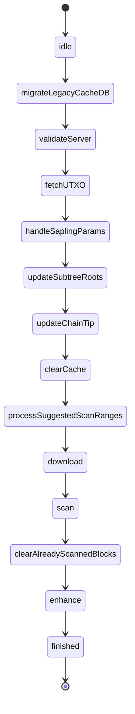

# CompactBlockProcessor and the Action State Machine

## 1. Why this chapter exists

The sync engine is a state machine, not a procedure. This chapter
answers "what are the states, what runs each state, and how does control
move from one state to the next?". If you do not understand that
`CompactBlockProcessor` is an actor running a single `while` loop over a
`[CBPState: Action]` dictionary, that each `Action` returns a mutated
`ActionContext` carrying the next state, and that actions run strictly
one at a time, you will add an action that never runs, mutate shared
context unsafely, or break the cancellation contract. By the end you
will be able to list the `CBPState` cases, read any one `Action`, and
say which context fields it reads and writes. The files you touch are
`Sources/ZcashLightClientKit/Block/CompactBlockProcessor.swift`,
`Sources/ZcashLightClientKit/Block/Actions/Action.swift`, and the action
files under `Sources/ZcashLightClientKit/Block/Actions/`.

## 2. Definitions

**Definition 2.1 (CBPState).** The state set of the sync state machine.
Verified by reading the `enum CBPState: CaseIterable` in
`Sources/ZcashLightClientKit/Block/Actions/Action.swift` lines 61-80,
the cases are: `idle`, `migrateLegacyCacheDB`, `validateServer`,
`updateSubtreeRoots`, `updateChainTip`, `processSuggestedScanRanges`,
`rewind`, `download`, `scan`, `clearAlreadyScannedBlocks`, `enhance`,
`fetchUTXO`, `handleSaplingParams`, `clearCache`, `txResubmission`,
`finished`, `failed`, `stopped`. Four of these (`idle`, `finished`,
`failed`, `stopped`) have no `Action`; they are loop boundaries.

**Definition 2.2 (Action).** The unit of work for one state. The
protocol (`Action.swift` lines 82-99) has one property,
`removeBlocksCacheWhenFailed: Bool`, and two methods: `run(with:
didUpdate:) -> ActionContext` and `stop()`. An action reads from the
context, does its work, sets the next `state` on the context, and
returns it.

**Definition 2.3 (ActionContext).** The shared mutable state threaded
through the machine, declared as a protocol (`Action.swift` lines 10-28)
and implemented by the `actor ActionContextImpl` (lines 30-59). It
carries the current `state`, the `prevState`, `syncControlData`, a
`requestedRewindHeight`, the `processedHeight`, the
`lastChainTipUpdateTime`, and the last scanned / downloaded / enhanced
heights. Because it is an `actor`, every read and write is `async`.

**Invariant 2.4 (actions run sequentially).** The state machine is
linear: the `run()` loop executes exactly one action at a time and only
starts the next after the current `await action.run(...)` returns
(`CompactBlockProcessor.swift` lines 628-644). The scan _order_ over
block heights is non-linear ("spend before sync", see
[scan, enhance, fetch](./09-scan-enhance-fetch.md)), but the action
sequence that drives it is not. There is no parallel action execution.

**Rule 2.5 (every state must map to an action or a boundary).** The
action table is built once from `CBPState.allCases`
(`CompactBlockProcessor.swift` lines 210-250). Any state with no entry
in `actions` is treated by `run()` as a terminal/boundary state: the
loop calls `stopAllActions()` and either finishes the sync or breaks
(lines 617-626). A new state with no table entry silently ends the loop.

## 3. The code

### 3.1 The CBPState enum

```swift reference title="Sources/ZcashLightClientKit/Block/Actions/Action.swift"
https://github.com/zcash/zcash-swift-wallet-sdk/blob/fe836893bc71fc3e6eb173f4fc191aa43c3760af/Sources/ZcashLightClientKit/Block/Actions/Action.swift#L61-L80
```

### 3.2 The Action protocol

`removeBlocksCacheWhenFailed` decides whether a thrown error from this
action triggers a clear of the on-disk compact-block cache. `run`
receives the context and a `didUpdate` closure for partial-progress
reporting and returns the (mutated) context.

```swift reference title="Sources/ZcashLightClientKit/Block/Actions/Action.swift"
https://github.com/zcash/zcash-swift-wallet-sdk/blob/fe836893bc71fc3e6eb173f4fc191aa43c3760af/Sources/ZcashLightClientKit/Block/Actions/Action.swift#L82-L99
```

### 3.3 The ActionContext actor

The protocol lists the readable properties and the `update(...)`
mutators; the implementing actor serializes all of them. Note that
`update(state:)` records the old state into `prevState` (lines 48-51) so
that an action can branch on where it came from, which `UpdateChainTipAction`
relies on (see 3.6).

```swift reference title="Sources/ZcashLightClientKit/Block/Actions/Action.swift"
https://github.com/zcash/zcash-swift-wallet-sdk/blob/fe836893bc71fc3e6eb173f4fc191aa43c3760af/Sources/ZcashLightClientKit/Block/Actions/Action.swift#L30-L59
```

### 3.4 The state -> Action mapping

`makeActions` builds the `[CBPState: Action]` dictionary by switching
over every case of `CBPState.allCases`. The boundary states (`finished`,
`failed`, `stopped`, `idle`) return `nil` and so get no entry (lines
242-243). This is the table the run loop consults.

```swift reference title="Sources/ZcashLightClientKit/Block/CompactBlockProcessor.swift"
https://github.com/zcash/zcash-swift-wallet-sdk/blob/fe836893bc71fc3e6eb173f4fc191aa43c3760af/Sources/ZcashLightClientKit/Block/CompactBlockProcessor.swift#L210-L250
```

### 3.5 The main run loop / nextAction logic

`run()` is one `while true` loop. The interesting branches:

- Precondition `context.state == .idle`: the loop bootstraps a sync by
  stopping any leftover action work and moving to the first real state,
  `.migrateLegacyCacheDB` (lines 600-611).
- Precondition `actions[state] == nil`: the state is a boundary; the
  loop finishes or breaks (lines 617-626).
- Precondition otherwise: it checks for cancellation, runs the action,
  reassigns `context` to the action's returned context, and calls
  `didFinishAction()` (lines 628-644).
- On `throw`: it classifies the error. Transient gRPC/service errors
  under the retry budget reset the context and loop again; cancellation
  stops the loop; anything else is a hard failure (lines 645-694).

```swift reference title="Sources/ZcashLightClientKit/Block/CompactBlockProcessor.swift"
https://github.com/zcash/zcash-swift-wallet-sdk/blob/fe836893bc71fc3e6eb173f4fc191aa43c3760af/Sources/ZcashLightClientKit/Block/CompactBlockProcessor.swift#L599-L644
```

The error-classification and retry path that follows is what makes the
machine resilient to a flapping connection: a service error forces a
fresh gRPC channel and a context reset rather than a hard stop.

```swift reference title="Sources/ZcashLightClientKit/Block/CompactBlockProcessor.swift"
https://github.com/zcash/zcash-swift-wallet-sdk/blob/fe836893bc71fc3e6eb173f4fc191aa43c3760af/Sources/ZcashLightClientKit/Block/CompactBlockProcessor.swift#L645-L694
```

`handleSyncFailure` is where `removeBlocksCacheWhenFailed` is honored:
if the failed action set it, the block cache is cleared before
reporting the failure.

```swift reference title="Sources/ZcashLightClientKit/Block/CompactBlockProcessor.swift"
https://github.com/zcash/zcash-swift-wallet-sdk/blob/fe836893bc71fc3e6eb173f4fc191aa43c3760af/Sources/ZcashLightClientKit/Block/CompactBlockProcessor.swift#L708-L715
```

### 3.6 A representative action

`UpdateChainTipAction` is a good example because it both reads and
writes the context and branches on `prevState`. It reads
`lastChainTipUpdateTime` and `prevState`; it writes
`lastChainTipUpdateTime` (indirectly, via `updateChainTip`) and the next
`state`. If it came from `updateSubtreeRoots` or more than 600 seconds
have passed it refreshes the chain tip from lightwalletd, asks Rust to
record it, and moves to `.clearCache`; if it came from `txResubmission`
it moves to `.download`.

```swift reference title="Sources/ZcashLightClientKit/Block/Actions/UpdateChainTipAction.swift"
https://github.com/zcash/zcash-swift-wallet-sdk/blob/fe836893bc71fc3e6eb173f4fc191aa43c3760af/Sources/ZcashLightClientKit/Block/Actions/UpdateChainTipAction.swift#L38-L59
```

Contrast with `ValidateServerAction`, which reads only the config and
the server `getInfo` response, performs no context reads beyond that,
and unconditionally sets the next state to `.fetchUTXO`.

```swift reference title="Sources/ZcashLightClientKit/Block/Actions/ValidateServerAction.swift"
https://github.com/zcash/zcash-swift-wallet-sdk/blob/fe836893bc71fc3e6eb173f4fc191aa43c3760af/Sources/ZcashLightClientKit/Block/Actions/ValidateServerAction.swift#L24-L63
```

### 3.7 The ordered pipeline

The exact transitions are documented in `docs/cbp_state_machine.puml`
and encoded in the actions' `update(state:)` calls. Reading the source
(each action's `run`) and the puml together, the steady-state happy path
is, in order:

1. `migrateLegacyCacheDB` (`MigrateLegacyCacheDBAction`) - one-time
   migration off the old sqlite cacheDb; see
   [download and filesystem storage](./08-download-and-filesystem-storage.md).
2. `validateServer` (`ValidateServerAction`) - network/branch checks
   against lightwalletd; see [networking: gRPC](./11-networking-grpc.md).
3. `fetchUTXO` (`FetchUTXOsAction`) - fetch transparent UTXOs; see
   [scan, enhance, fetch](./09-scan-enhance-fetch.md).
4. `handleSaplingParams` (`SaplingParamsAction`) - ensure Sapling proving
   parameters are present; see
   [transactions: proposal to broadcast](./13-transactions-proposal-to-broadcast.md).
5. `updateSubtreeRoots` (`UpdateSubtreeRootsAction`) - sync note-commitment
   subtree roots from the server.
6. `updateChainTip` (`UpdateChainTipAction`) - record the chain tip in
   Rust (3.6).
7. `clearCache` (`ClearCacheAction`) - clear the compact-block cache; see
   [download and filesystem storage](./08-download-and-filesystem-storage.md).
8. `processSuggestedScanRanges` (`ProcessSuggestedScanRangesAction`) -
   ask Rust which ranges to scan next; this is where "spend before sync"
   chooses non-linear scan order; see
   [scan, enhance, fetch](./09-scan-enhance-fetch.md).
9. `download` (`DownloadAction`) - download a range of compact blocks;
   see [download and filesystem storage](./08-download-and-filesystem-storage.md).
10. `scan` (`ScanAction`) - scan downloaded blocks for notes/nullifiers;
    on a continuity error it transitions to `rewind`; see
    [scan, enhance, fetch](./09-scan-enhance-fetch.md).
11. `clearAlreadyScannedBlocks` (`ClearAlreadyScannedBlocksAction`) -
    drop blocks already scanned.
12. `enhance` (`EnhanceAction`) - enhance found transactions in batches;
    see [scan, enhance, fetch](./09-scan-enhance-fetch.md).
13. `txResubmission` (`TxResubmissionAction`) - retry pending
    submissions; see
    [broadcaster and multi-server submission](./14-broadcaster-multi-server-submission.md).
14. `rewind` (`RewindAction`) - reached on reorg/continuity error; rewinds
    and re-derives scan ranges.

The terminal states `finished`, `failed`, `stopped` end the loop. Refer
to `docs/cbp_state_machine.puml` for the exact branch labels (for
example `updateChainTip` can also go straight to `download` when a scan
range is still being processed).

A compact view of the happy path:



### 3.8 didFinishAction and the event side effects

After each action returns, `didFinishAction()` switches on the new
`context.state` to emit a couple of UI-visible events (`.startedEnhancing`,
`.startedFetching`). Most states emit nothing here; the events that the
[synchronizer](./06-synchronizer-and-public-api.md) cares about
(progress, finished) are sent from inside the action's `didUpdate`
closure and from `syncFinished()`.

```swift reference title="Sources/ZcashLightClientKit/Block/CompactBlockProcessor.swift"
https://github.com/zcash/zcash-swift-wallet-sdk/blob/fe836893bc71fc3e6eb173f4fc191aa43c3760af/Sources/ZcashLightClientKit/Block/CompactBlockProcessor.swift#L717-L758
```

## 4. Failure modes

- Adding a new `CBPState` case but not wiring it into `makeActions`
  (3.4): the run loop treats it as a boundary and silently ends the sync
  when reached (Rule 2.5). Caught by:
  `Tests/OfflineTests/CompactBlockProcessorActions/ActionContextStateTests.swift`
  exercises `CBPState`/context transitions; a missing mapping surfaces
  there, but the silent-end behavior itself has no dedicated test and is
  caught by audit only.
- Mutating `ActionContext` non-atomically by reading a value, computing,
  and writing it back across multiple `await` points: although each
  `update` is serialized by the actor, an interleaved read-modify-write
  is not atomic as a whole. Keep the next-state decision inside the
  action's own `run`. Caught by: no automated test in this workspace;
  caught by audit only.
- Throwing from an action that mutated on-disk block cache without
  setting `removeBlocksCacheWhenFailed = true`: the cache is left in a
  partial state because `handleSyncFailure` (3.5) only clears it when
  the flag is set. Caught by:
  `Tests/OfflineTests/CompactBlockProcessorActions/ValidateServerActionTests.swift`
  asserts the error paths of an action whose flag is `false`
  (`testValidateServerAction_ChainNameError` at line 41 and the other
  `*Error` tests); the cache-clearing flag itself is asserted in the
  per-action tests under `CompactBlockProcessorActions/`.
- Doing work in parallel across two actions by spawning a detached task
  inside `run`: breaks Invariant 2.4 and races the shared context. Caught
  by: no automated test in this workspace; caught by audit only.

## 5. Spec pointers

- `docs/cbp_state_machine.puml` in this repo: the authoritative state
  diagram, including the branch labels this chapter summarizes (the
  source comment at `CompactBlockProcessor.swift` lines 589-590 tells you
  to keep code and puml in sync).
- The librustzcash crates (https://github.com/zcash/librustzcash):
  `suggestScanRanges` and `updateChainTip` called from the actions are
  thin wrappers over `zcash_client_backend`/`zcash_client_sqlite`; the
  "spend before sync" scan-range scheduling lives there.
- Zcash Protocol Specification
  (https://zips.z.cash/protocol/protocol.pdf): the note-commitment tree
  and subtree roots that `updateSubtreeRoots` synchronizes are defined in
  the Sapling/Orchard sections; relevant to step 5 of the pipeline.
- The lightwalletd repo (https://github.com/zcash/lightwalletd): the
  `GetSubtreeRoots`, `GetLatestBlock`, and block-streaming RPCs the
  download/validate/updateSubtreeRoots actions call.

## 6. Exercises

1. List the CBPState cases with the line range. Open
   `Sources/ZcashLightClientKit/Block/Actions/Action.swift`, find the
   `enum CBPState`, and write down every case and the exact line range of
   the enum.

2. Read one action and state its context I/O. Pick any file under
   `Sources/ZcashLightClientKit/Block/Actions/` other than
   `UpdateChainTipAction` and `ValidateServerAction`, read its `run`, and
   write down which `ActionContext` fields it reads (`await context.<x>`)
   and which it writes (`await context.update(...)`), plus the next
   state(s) it can set.

3. (Code modification.) Add a single injected-`logger` `debug` line at
   the top of `ValidateServerAction.run`
   (`Sources/ZcashLightClientKit/Block/Actions/ValidateServerAction.swift`)
   that logs `"entering validateServer"`. Use the action's own logger or
   add one via the container; do not use `print`/`NSLog`. Run
   `swift test --filter OfflineTests` and confirm the
   `ValidateServerActionTests` still pass.

### Answers in the code

- Exercise 1: `enum CBPState: CaseIterable` is at
  `Sources/ZcashLightClientKit/Block/Actions/Action.swift` lines 61-80.
- Exercise 2: each action file is in
  `Sources/ZcashLightClientKit/Block/Actions/`; the read/write surface is
  the set of `await context.<property>` and `await context.update(...)`
  calls inside its `run`. Compare with `UpdateChainTipAction.swift` lines
  41-56 as a worked example.
- Exercise 3: the method to edit is `run` in
  `ValidateServerAction.swift` lines 27-60; the matching tests are
  `Tests/OfflineTests/CompactBlockProcessorActions/ValidateServerActionTests.swift`
  (`testValidateServerAction_NextAction` at line 27).

## 7. Further reading

- `docs/cbp_state_machine.puml` and the generated
  `docs/images/cbp_state_machine.png`: the full branch set including the
  two `txResubmission` variants and the rewind path.
- [Scan, enhance, fetch](./09-scan-enhance-fetch.md): the actions that do
  the heavy work the state machine schedules, and the detail of "spend
  before sync".
